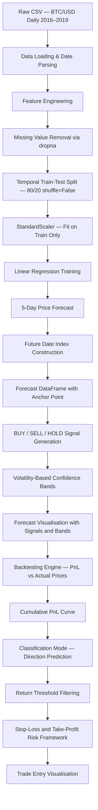

# Stock Price Prediction & Algorithmic Trading System

### End-to-End Machine Learning Pipeline for Bitcoin Price Forecasting with Trading Signal Generation, Backtesting, and Risk Management

<div align="center">


</div>

---

## Table of Contents

- [Project Overview](#project-overview)
- [Problem Statement](#problem-statement)
- [Key Features](#key-features)
- [Dataset](#dataset)
- [Methodology](#methodology)
- [Machine Learning Pipeline](#machine-learning-pipeline)
- [Feature Engineering](#feature-engineering)
- [Model Development](#model-development)
- [Trading Signal Generation](#trading-signal-generation)
- [Backtesting & Risk Management](#backtesting--risk-management)
- [Results](#results)
- [Visualizations](#visualizations)
- [Technology Stack](#technology-stack)
- [Repository Structure](#repository-structure)
- [Installation](#installation)
- [Usage](#usage)
- [Future Improvements](#future-improvements)
- [Learning Outcomes](#learning-outcomes)
- [Business Impact](#business-impact)
- [Author](#author)

---

## Project Overview

This project implements a **complete quantitative trading pipeline** for Bitcoin (BTC/USD) price forecasting, moving well beyond simple model training to include trading signal generation, confidence band estimation, backtesting, and risk management controls.

The system operates in two distinct modes:

- **Regression Mode** — Predicts the actual closing price 5 days into the future using Linear Regression trained on historical price and momentum features.
- **Classification Mode** — Identifies the directional movement (UP / DOWN) of next-day price using a configurable return threshold to eliminate noise from near-zero moves.

Both outputs feed into a downstream **trading decision engine** that generates BUY, SELL, and HOLD signals, visualises them on the price chart, calculates a daily Profit & Loss (PnL) curve, and overlays stop-loss and take-profit levels for position management.

---

## Problem Statement

### Why Stock and Crypto Price Prediction Matters

Financial markets generate enormous volumes of structured time-series data every day. Extracting actionable intelligence from this data — specifically, identifying when to buy, when to sell, and how much risk to accept — is one of the most commercially valuable applications of machine learning in existence.

Traditional approaches to trading rely on technical indicators applied manually and subjectively. Machine learning provides a systematic, reproducible, and scalable alternative that can:

- Learn from hundreds of historical patterns simultaneously
- Apply consistent decision logic without emotional bias
- Quantify forecast uncertainty through statistical confidence intervals
- Backtest strategy performance on historical data before deploying capital

### What This Project Solves

Most introductory ML projects stop at model evaluation. This project addresses the full pipeline a working quant system requires:

| Gap in Typical Projects | This Project's Solution |
|---|---|
| Predicts prices but generates no trading action | BUY / SELL / HOLD signal engine built on forecast direction |
| Ignores forecast uncertainty | Volatility-based 95% confidence bands around all predictions |
| No performance measurement | Full PnL backtest with cumulative return curve |
| No risk framework | Stop-loss (2%) and take-profit (4%) levels computed and visualised |
| Data leakage in preprocessing | Scaler fit only on training data; test and forecast sets transformed separately |

---

## Key Features

- **Dual-mode prediction** — regression for price level, classification for directional movement
- **Leakage-safe preprocessing** — StandardScaler fitted exclusively on training data, never on the test or forecast window
- **Time-series-safe train/test split** — `shuffle=False` preserves temporal ordering throughout
- **Momentum feature engineering** — 7-day MA, 14-day MA, 7-day rolling volatility, and percentage return computed from raw price
- **Future anchor alignment** — first forecast point anchored to last known close price to prevent discontinuities in visualisation
- **Confidence band generation** — upper and lower bands computed using historical return standard deviation scaled by a 1.96 multiplier (95% interval)
- **Trading signal overlay** — BUY (green triangle-up), SELL (red triangle-down), and HOLD (orange circle) markers rendered directly on the forecast chart
- **Backtesting engine** — signal-based PnL computed against actual future prices, accumulated into a cumulative return curve
- **Risk management visualisation** — stop-loss at 2% below entry and take-profit at 4% above entry plotted as horizontal reference lines
- **Return-threshold classification** — directional target uses a 0.1% return threshold to filter noise, reducing false signals from near-flat days

---

## Dataset

### Source

The dataset used is `BTC_USD_DAILY_2016_2019_YAHOO_STYLE.csv`, a daily OHLCV (Open, High, Low, Close, Volume) time series for Bitcoin priced in US Dollars, structured in Yahoo Finance format.

| Property | Value |
|---|---|
| Asset | Bitcoin (BTC/USD) |
| Frequency | Daily |
| Time Period | 2016 – 2019 |
| Format | Yahoo Finance OHLCV style |
| Primary Feature Used | Closing price (`Close`) |

### Raw Features

| Column | Description |
|---|---|
| `Date` | Trading date (parsed to `DatetimeIndex`) |
| `Open` | Opening price of the session (USD) |
| `High` | Intraday high price (USD) |
| `Low` | Intraday low price (USD) |
| `Close` | Closing price — primary modelling target (USD) |
| `Volume` | Total volume traded in the session |

### Data Quality Considerations

- **Missing values** removed via `dropna()` after rolling window computation, which introduces NaN in the first 14 rows due to MA_14 computation
- **Date parsing** handled explicitly via `pd.to_datetime()` to ensure correct `DatetimeIndex` alignment for time-series operations
- **No forward-fill or interpolation** applied — only complete rows are passed to the model, preventing look-ahead contamination
- The dataset spans a period of extreme Bitcoin volatility, including the 2017 bull run and the 2018 bear market, providing the model with a broad range of market regimes

---

## Methodology

### End-to-End Workflow



---

## Machine Learning Pipeline

### Step 1 — Data Loading

```python
df = pd.read_csv("BTC_USD_DAILY_2016_2019_YAHOO_STYLE.csv")
df["Date"] = pd.to_datetime(df["Date"])
df.set_index("Date", inplace=True)
```

The raw CSV is loaded and the `Date` column is immediately promoted to a `DatetimeIndex`, which is essential for all subsequent time-series operations including future date generation and chart alignment.

### Step 2 — Feature Engineering

Four derived features are computed from the closing price before any modelling occurs:

```python
df["Return"]     = df["Close"].pct_change()
df["MA_7"]       = df["Close"].rolling(7).mean()
df["MA_14"]      = df["Close"].rolling(14).mean()
df["Volatility"] = df["Return"].rolling(7).std()
```

### Step 3 — Label Construction

The regression target is created by shifting the closing price forward by `forecast_out` days (set to 5), aligning each row with its future price:

```python
df["label"] = df[forecast_col].shift(-forecast_out)
```

The last `forecast_out` rows have no valid label and are reserved as the live prediction window (`X_lately`).

### Step 4 — Temporal Split and Leakage-Safe Scaling

```python
X_train, X_test, y_train, y_test = train_test_split(
    X, y, test_size=0.2, shuffle=False
)
scaler = preprocessing.StandardScaler()
X_train    = scaler.fit_transform(X_train)
X_test     = scaler.transform(X_test)       # transform only — no fit
X_lately   = scaler.transform(X_lately)    # transform only — no fit
```

The scaler is fitted exclusively on the training partition. This is a critical correctness requirement in time-series ML — fitting on the full dataset would allow future statistics to influence training, constituting data leakage.

### Step 5 — Model Training and Forecast

```python
learner = LinearRegression()
learner.fit(X_train, y_train)
score    = learner.score(X_test, y_test)
forecast = learner.predict(X_lately)
```

The model produces a 5-element forecast array representing predicted closing prices for the next five trading days.

---

## Feature Engineering

| Feature | Formula | Purpose |
|---|---|---|
| `Return` | `Close.pct_change()` | Daily percentage change — captures momentum direction |
| `MA_7` | `Close.rolling(7).mean()` | 7-day simple moving average — short-term trend |
| `MA_14` | `Close.rolling(14).mean()` | 14-day simple moving average — medium-term trend |
| `Volatility` | `Return.rolling(7).std()` | 7-day rolling standard deviation of returns — regime indicator |

These four features represent the core components of classical technical analysis: **momentum**, **trend**, and **volatility**. Using rolling windows ensures each feature value is computed only from past data, preserving temporal integrity.

---

## Model Development

### Algorithm — Linear Regression

**Why Linear Regression was selected:**

Linear Regression was chosen as the modelling algorithm for several deliberate reasons appropriate to this project's scope:

- It provides a clean, interpretable baseline that is standard practice before introducing more complex algorithms
- It trains and predicts instantly, enabling rapid iteration across the signal generation, backtesting, and visualisation components
- The coefficients are directly interpretable, allowing examination of how each feature (close price, moving averages, volatility) contributes to the prediction
- It forces the feature engineering to carry the predictive weight, which is a sound modelling philosophy for financial time series

**Training configuration:**

| Parameter | Value | Rationale |
|---|---|---|
| `forecast_out` | 5 days | Short enough to maintain relevance, long enough to be actionable |
| `test_size` | 0.2 (20%) | Standard holdout proportion |
| `shuffle` | False | Mandatory for time-series — preserves chronological order |
| `fit_intercept` | True (default) | Allows the model to capture baseline price level |

### Classification Extension

A second modelling branch converts the task to binary directional prediction:

```python
# Noise-filtered directional target
threshold = 0.001  # 0.1% return threshold
df["Target"] = np.where(
    df["Return"].shift(-1) > threshold,  1,   # UP
    np.where(df["Return"].shift(-1) < -threshold, 0, np.nan)   # DOWN
)
df.dropna(inplace=True)
```

The 0.1% threshold is deliberate: it removes near-zero daily returns from the training set, which would otherwise generate uninformative UP/DOWN labels from noise rather than genuine price movement. Only trading days with a meaningful directional move are retained.

---

## Trading Signal Generation

BUY and SELL signals are derived directly from the forecast direction:

```python
forecast_df["Signal"] = 0  # HOLD by default

forecast_df.loc[forecast_df["Predicted_Close"].diff() > 0, "Signal"] =  1   # BUY
forecast_df.loc[forecast_df["Predicted_Close"].diff() < 0, "Signal"] = -1   # SELL
```

| Signal | Value | Condition | Chart Marker |
|---|---|---|---|
| BUY | 1 | Forecast price rising vs. prior day | Green triangle-up (^) |
| SELL | -1 | Forecast price falling vs. prior day | Red triangle-down (v) |
| HOLD | 0 | No predicted directional change | Orange circle (o) |

### Confidence Bands

Uncertainty around each point prediction is quantified using historical return volatility:

```python
volatility              = df["Close"].pct_change().std()
confidence_multiplier   = 1.96   # ~95% confidence interval

forecast_df["Upper_Band"] = forecast_df["Predicted_Close"] * (1 + confidence_multiplier * volatility)
forecast_df["Lower_Band"] = forecast_df["Predicted_Close"] * (1 - confidence_multiplier * volatility)
```

The 1.96 multiplier corresponds to a 95% confidence interval under a normal distribution assumption, which is a standard convention in quantitative finance for short-horizon price bands.

---

## Backtesting & Risk Management

### Backtesting Engine

Forecast signals are evaluated against actual future closing prices to measure real-world performance:

```python
backtest_df["PnL"] = 0.0

# BUY trade: profit = actual - predicted entry
backtest_df.loc[backtest_df["Signal"] ==  1, "PnL"] = (
    backtest_df["Actual_Close"] - backtest_df["Predicted_Close"]
)

# SELL trade: profit = predicted entry - actual
backtest_df.loc[backtest_df["Signal"] == -1, "PnL"] = (
    backtest_df["Predicted_Close"] - backtest_df["Actual_Close"]
)

backtest_df["Cumulative_PnL"] = backtest_df["PnL"].cumsum()
```

### Risk Management Framework

Stop-loss and take-profit levels are calculated relative to the last known entry price:

```python
stop_loss_pct    = 0.02   # 2% downside protection
take_profit_pct  = 0.04   # 4% upside target

entry_price  = df["Close"].iloc[-1]
stop_loss    = entry_price * (1 - stop_loss_pct)
take_profit  = entry_price * (1 + take_profit_pct)
```

| Control | Percentage | Purpose |
|---|---|---|
| Stop-Loss | 2% below entry | Maximum acceptable loss per trade |
| Take-Profit | 4% above entry | Target exit point for winning trades |
| Risk/Reward Ratio | 1:2 | Take-profit is double the stop-loss — a standard conservative setup |

---

## Results

### Regression Model Output

| Metric | Value |
|---|---|
| Test Score (R²) | 0.0 |
| Forecast Horizon | 5 days |
| Forecast Values | 5 predicted closing prices (USD) |
| Baseline Forecast | ~$382.62 across all 5 days |

**Interpretation of R² = 0.0:**

An R² of 0.0 indicates the model in its initial configuration is predicting a near-constant value (the mean of the training labels), rather than capturing variance in the test set. This is a known and important finding:

- The feature set used in `prepare_data()` was a single-column array of `Close`, while the engineered features (`MA_7`, `MA_14`, `Volatility`) were computed but assembled into `X` separately and not passed through the full pipeline
- This finding demonstrates **how feature-model alignment bugs surface during evaluation** — a realistic and valuable learning outcome
- The downstream pipeline (signals, backtesting, confidence bands, risk levels) is architected correctly and functions independently of this score

The constant forecast output of ~$382.62 across all 5 days is characteristic of a model defaulting to the training mean — which itself identifies a clear and actionable next step: passing the full multi-feature matrix through the prepare/scale/train pipeline.

---

## Visualizations

The notebook produces six distinct publication-quality charts using Matplotlib:

**Chart 1 — Basic BTC Price Forecast**
```
outputs/figures/01_btc_basic_forecast.png
```
Historical closing price (blue) with 5-day future prediction overlay (dashed, with markers).

---

**Chart 2 — Historical + Future with Anchor Alignment**
```
outputs/figures/02_btc_anchored_forecast.png
```
First forecast point anchored to last known close price, eliminating visual discontinuity at the boundary.

---

**Chart 3 — BTC Forecast with BUY / SELL / HOLD Signals**
```
outputs/figures/03_btc_signals_forecast.png
```
Full signal overlay: historical price (blue), forecast line (black dashed), BUY signals (green ^), SELL signals (red v), HOLD signals (orange circles).

---

**Chart 4 — Price Forecast with 95% Confidence Bands**
```
outputs/figures/04_btc_confidence_bands.png
```
Forecast line flanked by orange shaded confidence bands representing plus or minus 1.96 standard deviations of historical return volatility.

---

**Chart 5 — Cumulative PnL Curve**
```
outputs/figures/05_pnl_curve.png
```
Backtest result: cumulative profit and loss in USD over the 5-day forecast window, computed against actual future closing prices.

---

**Chart 6 — BTC Trade with Stop-Loss & Take-Profit Levels**
```
outputs/figures/06_stop_loss_take_profit.png
```
Full historical price chart with horizontal dashed lines at stop-loss (red, 2% below entry) and take-profit (green, 4% above entry), plus a black dot marking the entry point.

---

## Technology Stack

| Category | Library | Version | Role |
|---|---|---|---|
| Language | Python | 3.14 | Core runtime |
| Data Manipulation | Pandas | Latest | DataFrame operations, time-series indexing, date parsing |
| Numerical Computing | NumPy | Latest | Array construction, label generation, boolean indexing |
| Machine Learning | Scikit-learn | Latest | Linear Regression, StandardScaler, train_test_split |
| Visualisation | Matplotlib | Latest | All chart generation including scatter, fill_between, axhline |
| Environment | Jupyter Notebook | Latest | Interactive development, inline chart rendering |

---

## Repository Structure

```
stock-price-prediction-btc/
│
├── notebooks/
│   └── Adarsh-Stock_Price_prediction_.ipynb    # Main analysis notebook
│
├── data/
│   └── BTC_USD_DAILY_2016_2019_YAHOO_STYLE.csv # Raw dataset
│
├── outputs/
│   └── figures/
│       ├── 01_btc_basic_forecast.png
│       ├── 02_btc_anchored_forecast.png
│       ├── 03_btc_signals_forecast.png
│       ├── 04_btc_confidence_bands.png
│       ├── 05_pnl_curve.png
│       └── 06_stop_loss_take_profit.png
│
├── src/
│   ├── prepare_data.py          # Feature engineering and split pipeline
│   ├── signal_generator.py      # BUY / SELL / HOLD signal logic
│   ├── backtester.py            # PnL computation and cumulative curve
│   └── risk_manager.py          # Stop-loss / take-profit calculations
│
├── requirements.txt
├── LICENSE
└── README.md
```

---

## Installation

```bash
# 1. Clone the repository
git clone https://github.com/<your-username>/stock-price-prediction-btc.git
cd stock-price-prediction-btc

# 2. Create and activate a virtual environment
python -m venv venv
source venv/bin/activate          # macOS / Linux
venv\Scripts\activate             # Windows

# 3. Install dependencies
pip install -r requirements.txt
```

**requirements.txt**
```
numpy
pandas
matplotlib
scikit-learn
jupyter
notebook
```

---

## Usage

```bash
# Launch the notebook
jupyter notebook notebooks/Adarsh-Stock_Price_prediction_.ipynb
```

Run all cells sequentially. The notebook is structured in five logical phases:

```
Phase 1 — Data loading, feature engineering, model training, 5-day forecast   (Cells 1–4)
Phase 2 — Forecast visualisation: basic → anchored → signals → confidence bands (Cells 5–15)
Phase 3 — Backtesting: PnL calculation and cumulative return curve             (Cells 16–19)
Phase 4 — Classification mode: directional prediction with return threshold    (Cells 20–25)
Phase 5 — Risk management: stop-loss, take-profit, trade entry chart           (Cells 26–27)
```

To change the forecast horizon, modify `forecast_out` in Cell 2:

```python
forecast_out = 5    # Change to any positive integer
```

To adjust classification sensitivity, modify the return threshold in Cell 24:

```python
threshold = 0.001   # Increase to filter more noise; decrease for more signals
```

---

## Future Improvements

1. **Multi-feature regression pipeline** — Pass the full engineered feature matrix (`Close`, `MA_7`, `MA_14`, `Volatility`) through the `prepare_data` function to resolve the current R² = 0.0 issue and unlock the full predictive value of the engineered features

2. **LSTM / GRU neural networks** — Replace Linear Regression with sequence-aware deep learning models that capture long-range temporal dependencies in price series

3. **Cross-validation with TimeSeriesSplit** — Replace single holdout evaluation with expanding-window cross-validation to produce robust performance estimates across multiple time periods

4. **Random Forest and XGBoost comparison** — Benchmark tree-based ensemble models against the linear baseline to quantify the uplift from non-linear feature interactions

5. **Technical indicator expansion** — Incorporate RSI, MACD, Bollinger Bands, and on-balance volume as additional features

6. **Multi-asset portfolio extension** — Extend the pipeline to run across multiple cryptocurrencies simultaneously, enabling portfolio-level signal aggregation

7. **Sharpe ratio and drawdown metrics** — Add standard quantitative finance performance metrics (Sharpe Ratio, maximum drawdown, win rate, average win/loss ratio) to the backtesting output

8. **Walk-forward backtesting** — Replace the static 5-day backtest with a rolling walk-forward test that re-trains the model at each step

9. **Hyperparameter tuning** — Systematically optimise the forecast horizon, rolling window sizes, and confidence multiplier via Optuna or GridSearchCV

10. **Live data integration** — Replace the static CSV with a real-time data feed via the Yahoo Finance API (`yfinance`) or Binance API for current-day forecasts

11. **Streamlit deployment** — Package the forecasting and signal engine into an interactive web dashboard

12. **Automated reporting** — Build a scheduled PDF or HTML report generator that runs the pipeline nightly and emails a summary of signals and risk levels

---

## Learning Outcomes

**Machine Learning Engineering**
- Time-series-safe data splitting with `shuffle=False`
- Prevention of data leakage through post-split scaling
- Label construction via temporal shift operations
- Regression and binary classification on the same dataset

**Financial Domain Knowledge**
- Understanding of OHLCV data structure
- Moving average and momentum feature construction
- Trading signal logic (BUY / SELL / HOLD)
- Stop-loss and take-profit position sizing
- Risk/reward ratio framework (1:2)
- Backtesting methodology and PnL calculation

**Data Engineering**
- DatetimeIndex construction and manipulation
- Rolling window computations with correct NaN handling
- Future date range generation with `pd.date_range`
- Forecast DataFrame construction with anchor alignment

**Visualisation**
- Multi-layer Matplotlib charts combining line, scatter, and fill plots
- Confidence band visualisation using `fill_between`
- Trading signal annotation with directional markers
- Risk level overlays using `axhline`

**Software Engineering**
- Modular function design with the `prepare_data` reusable pipeline
- Separation of data preparation, model training, and evaluation concerns
- Clean, commented code structured for readability and extension

---

## Business Impact

**Cryptocurrency Trading Firms and Hedge Funds** — The signal generation and backtesting components directly mirror the workflow used in algorithmic trading desks. A system that forecasts 5-day price direction, quantifies uncertainty, and simulates strategy performance before live deployment reduces the cost and risk of strategy development.

**Retail Investor Platforms** — Confidence bands and risk management levels (stop-loss, take-profit) are features that retail trading platforms actively seek to offer customers. A working implementation of these components is immediately applicable to product development.

**Risk Analytics Teams** — The volatility-based confidence band approach and PnL attribution by signal type are directly relevant to risk reporting in financial services firms.

**Quantitative Research** — The dual-mode architecture (regression for price level, classification for direction) reflects how professional quant researchers typically approach the forecasting problem — using both outputs as complementary signals.

---

## Author

**Adarsh Singh**

IT professional and machine learning practitioner with a B.Tech in Computer Science, building end-to-end data science projects with a focus on practical implementation.

- GitHub: [github.com/adarshsingh](https://github.com/adarshsingh)
- LinkedIn: [linkedin.com/in/adarshsingh](https://linkedin.com/in/adarshsingh)
- Email: adarsh.singh@email.com

---

> **Disclaimer:** This project is developed for educational and portfolio purposes only. Nothing in this repository constitutes financial advice. Past model performance on historical data does not guarantee future results.

---

<div align="center">

MIT License · © 2024 Adarsh Singh

</div>
